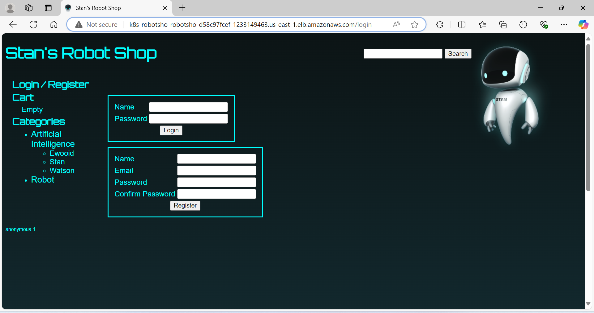

# General Overview

Stan's Robot Shop is a sample microservice application you can use as a sandbox to test and learn containerised application orchestration and monitoring techniques. It is not intended to be a comprehensive reference example of how to write a microservices application, although you will better understand some of those concepts by playing with Stan's Robot Shop. To be clear, the error handling is patchy and there is not any security built into the application.

You can get more detailed information from my [blog post](https://www.instana.com/blog/stans-robot-shop-sample-microservice-application/) about this sample microservice application.


# My EKS Project

This repository is derived from [Original Open Source Project](https://github.com/instana/robot-shop), which is an open-source project. 

## What I Have Deployed in AWS:
In this repository, I have used to deploy in AWS EKS cluster using Helm charts:
- **Feature 1**: Created a kubernetes cluster in AWS 
- **Feature 2**: Created a IAM role and OIDC connector provider
- **Feature 3**: Created a IAM role and installed AWS load balancer controller
- **Feature 4**: Created EBS CSI driver
- **Feature 5**: Deployed the microservices using helm charts

# Deploying a Three-Tier Architecture on AWS EKS
This guide outlines the steps to deploy a three-tier architecture application (e.g., Stan's Robot Shop) on AWS Elastic Kubernetes Service (EKS) using best practices and tools like eksctl, kubectl, and Helm.

### 1. Setting Up the EKS Cluster
Create an EKS Cluster
Use eksctl to create the cluster in the desired region.

```eksctl create cluster --name eks-3tier-cluster --region us-east-1```

### 2.Associate OIDC Provider
 Associate an OpenID Connect (OIDC) provider to the cluster for IAM role integration.

```eksctl utils associate-iam-oidc-provider --cluster eks-3tier-cluster --region us-east-1 --approve```

### 3. Configuring IAM Roles and Policies for AWS Load Balancer Controller

Create a service account with an IAM role for the AWS Load Balancer Controller.

```bash
eksctl create iamserviceaccount \
  --cluster=eks-3tier-cluster \
  --namespace=kube-system \
  --region=us-east-1 \
  --name=aws-load-balancer-controller \
  --role-name AmazonEKSLoadBalancerControllerRole \
  --attach-policy-arn=arn:aws:iam::account_id:policy/AWSLoadBalancerControllerIAMPolicy \
  --approve 
``` 
### 4. EBS CSI Driver
Create a service account and IAM role for the Elastic Block Store (EBS) CSI driver.

```bash
eksctl create iamserviceaccount \
  --name ebs-csi-controller-sa \
  --namespace kube-system \
  --cluster eks-3tier-cluster \
  --region us-east-1 \
  --role-name AmazonEKS_EBS_CSI_DriverRole \
  --role-only \
  --attach-policy-arn arn:aws:iam::aws:policy/service-role/AmazonEBSCSIDriverPolicy \
  --approve
```
### 5. Installing Kubernetes Add-ons
Deploy the Load Balancer Controller using Helm.

```bash
helm install aws-load-balancer-controller eks/aws-load-balancer-controller -n kube-system \
  --set clusterName=eks-3tier-cluster \
  --set serviceAccount.create=false \
  --set serviceAccount.name=aws-load-balancer-controller \
  --set region=us-east-1 \
  --set vpcId=VPC_ID
```

### 6. Install the EBS CSI driver as an add-on.

```bash
eksctl create addon \
  --name aws-ebs-csi-driver \
  --cluster eks-3tier-cluster \
  --region us-east-1 \
  --service-account-role-arn arn:aws:iam::account_id:role/AmazonEKS_EBS_CSI_DriverRole \
  --force
```
### 7. Deploying the Application

Navigate to helm directory and execute helm command
```helm install robot-shop --namespace robot-shop . ```

Screenshot for Pods,Services, Ingress


AWS Load Balancer Controller 


Launch the application using AWS load balancer controller DNS as shown below,



